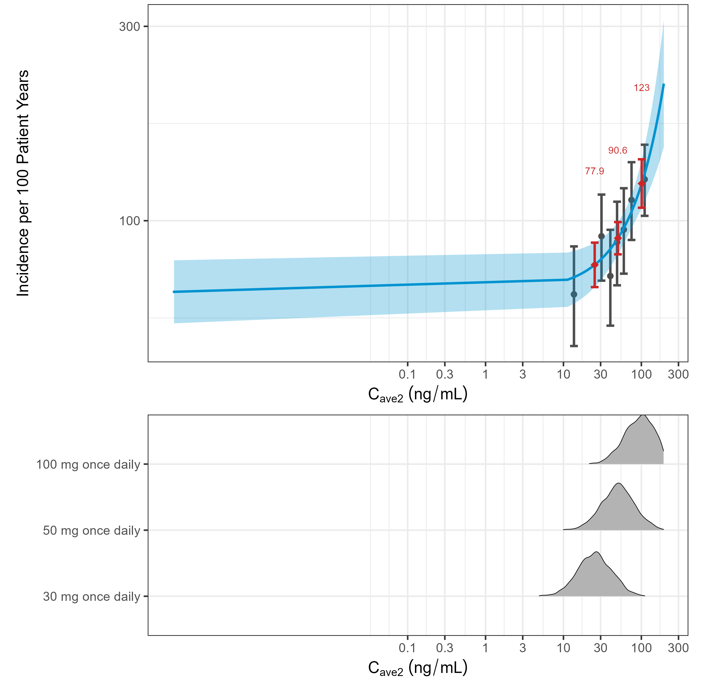
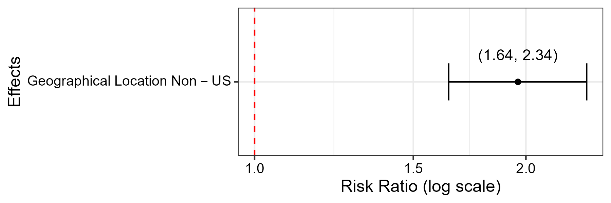

<style type="text/css">
  body{ /* Normal  */
      font-size: 18px;
  }
td {  /* Table  */
    font-size: 15px;
}
h1.title {
  font-size: 38px;
  color: DarkRed;
}
h1 { /* Header 1 */
    font-size: 30px;
  color: DarkBlue;
}
h2 { /* Header 2 */
    font-size: 25px;
  color: DarkBlue;
}
h3 { /* Header 3 */
    font-size: 20px;
  font-family: "Times New Roman", Times, serif;
  color: DarkBlue;
}
code.r{ /* Code block */
    font-size: 18px;
}
pre { /* Code block - determines code spacing between lines */
    font-size: 18px;
}
</style>
```{r setup, include=FALSE}
knitr::opts_chunk$set(fig.pos = "H", out.extra = "",echo = F)
library(tidyverse)
library(stringr)
library(kableExtra)
```
 
# EXECUTIVE SUMMARY

Poisson regression models were developed for Adverse Event Type 2,  and Adverse Event Type 3.

-  A model was developed for Adverse Event Type 2. The analysis dataset included a total of 504 events (50.40\% of study participants). The selected best exposure metric was C(ave2) (ng/mL) (p<0.0001). There was one covariate in the final model: Geographical Location.
-  A model was developed for Adverse Event Type 3. The analysis dataset included a total of 312 events (31.20\% of study participants). There was not a statistically significant exposure response relationship. There was one covariate in the final model: Sex.
  
# METHODS
  
  
- If the data does not allow for a full analysis due to low incidence of an endpoint (incidence <10\%), the E-R analysis for that endpoint was not conducted.
- An $\alpha$ of 0.01, which equates to a change in deviance greater than 6.63 ($\chi^2_{0.99}$), was used to identify an exposure metric for each endpoint analyzed. If no exposure metric met the $D$ criteria, the base, full, and final models did not include an exposure metric. If more than one exposure metric met the $D$ criteria, the exposure metric with the smallest p-value was selected. This is based on the rationale that smaller p-values indicate a better fit.
- Missing data within covariates was imputed provided the percentage of missing values was $\le$ 10\% for continuous covariates and $\le$ 10\% for categorical covariates. For continuous covariates, the median value was used for the imputed value. For categorical covariates, the mode was used for the imputed value. If the percentage of missing values was larger than the stated threshold, the covariates were excluded from consideration for the endpoint.
- The $\chi^2$ test for the log-likelihood difference in deviance between models was used to judge whether one model had a better fit over another during the backward elimination using an $\alpha$ of 0.01. When the removal of any of the remaining covariates results in a $\Delta D$ equivalent to p-value less than 0.01 the elimination process was stopped and the model was considered final.
Categorical covariate would be dropped in full model development if all events occurred in only one of its categories. If any of the covariates were highly correlated (e.g. AST and ALT) with a correlation coefficient $\ge$ 0.6, then only one of the correlated covariates was tested further based on univariate Deviance.
  
  
For the full method chapter, please see https://yuchenw2015.github.io/PoissonERM

# Observed Data \label{sec:observed}

```{r echo=FALSE, message=F, warning=F, paged.print=FALSE}
L <- readLines("Demog-Sum/Demographics-categorical.tex")
L2 <- gsub("\\hline", "", L)
L3 <- unname(sapply(L2, function(x) substr(x, 1, nchar(x)-2)))
L3 <- L3[L3!=""]
n_col <- max(str_count(L3, "\\&"))+1
boldn <- NULL
boldn <- (1:length(L3))[grepl("AIC",L3)]
multi.index <- L3[grepl("\\multicolumn", L3)]
multi.index.new <- gsub("\\}","",strsplit(multi.index, split = "\\}\\{") %>% sapply(function(x) x[3]) %>% unlist())
L4 <- L3
L4[grepl("\\multicolumn", L3)] <- paste(multi.index.new, paste(rep("&", n_col-1), collapse = " "))
DF <- read.table(text = L4, sep = "&", header = TRUE, strip.white = TRUE, check.names = FALSE)
kbl(DF, caption = "<span style=\"color: purple;\">Demographic Summaries of Categorical Covariates</span>") %>%
  footnote(general = c("This table was made from an automated script. Source:Demog-Sum/Demographics-categorical.tex"),
           general_title = "Note.", 
           footnote_as_chunk = TRUE) %>%
  kable_styling(full_width = T) %>%
  row_spec(c(boldn,(1:length(L3))[grepl("\\multicolumn", L3)])-1,bold=T,hline_after = T)
```
  
```{r echo=FALSE, message=F, warning=F, paged.print=FALSE}
L <- readLines("Demog-Sum/Demographics-continuous.tex")
L2 <- gsub("\\hline", "", L)
L3 <- unname(sapply(L2, function(x) substr(x, 1, nchar(x)-2)))
L3 <- L3[L3!=""]
n_col <- max(str_count(L3, "\\&"))+1
boldn <- NULL
boldn <- (1:length(L3))[grepl("AIC",L3)]
multi.index <- L3[grepl("\\multicolumn", L3)]
multi.index.new <- gsub("\\}","",strsplit(multi.index, split = "\\}\\{") %>% sapply(function(x) x[3]) %>% unlist())
L4 <- L3
L4[grepl("\\multicolumn", L3)] <- paste(multi.index.new, paste(rep("&", n_col-1), collapse = " "))
DF <- read.table(text = L4, sep = "&", header = TRUE, strip.white = TRUE, check.names = FALSE)
kbl(DF, caption = "<span style=\"color: purple;\">Demographic Summaries of Continuous Covariates</span>") %>%
  footnote(general = c("This table was made from an automated script. Source:Demog-Sum/Demographics-continuous.tex"),
           general_title = "Note.", 
           footnote_as_chunk = TRUE) %>%
  kable_styling(full_width = T) %>%
  row_spec(c(boldn,(1:length(L3))[grepl("\\multicolumn", L3)])-1,bold=T,hline_after = T)
```
  
```{r echo=FALSE, message=F, warning=F, paged.print=FALSE}
L <- readLines("Demog-Sum/EventsByProtocol.tex")
L2 <- gsub("\\hline", "", L)
L3 <- unname(sapply(L2, function(x) substr(x, 1, nchar(x)-2)))
L3 <- L3[L3!=""]
n_col <- max(str_count(L3, "\\&"))+1
boldn <- NULL
boldn <- (1:length(L3))[grepl("AIC",L3)]
multi.index <- L3[grepl("\\multicolumn", L3)]
multi.index.new <- gsub("\\}","",strsplit(multi.index, split = "\\}\\{") %>% sapply(function(x) x[3]) %>% unlist())
L4 <- L3
L4[grepl("\\multicolumn", L3)] <- paste(multi.index.new, paste(rep("&", n_col-1), collapse = " "))
DF <- read.table(text = L4, sep = "&", header = TRUE, strip.white = TRUE, check.names = FALSE)
kbl(DF, caption = "<span style=\"color: purple;\">Summary of Events By Endpoint</span>") %>%
  footnote(general = c("This table was made from an automated script. Source:Demog-Sum/EventsByProtocol.tex"),
           general_title = "Note.", 
           footnote_as_chunk = TRUE) %>%
  kable_styling(full_width = T) %>%
  row_spec(c(boldn,(1:length(L3))[grepl("\\multicolumn", L3)])-1,bold=T,hline_after = T)
```
  
```{r, echo=FALSE, out.width="100%", fig.cap="\\label{fig:CovEDAAdverseEventType1exp} <span style=\"color: purple;\">Adverse Event Type 1 Exposures</span>." ,fig.topcaption=TRUE, out.width = '85%'}

```
<font size=3> *Note. * This figure was made from an automated script. Source:Cov-EDA/Adverse-Event-Type-1-exp.png </font>
  
```{r, echo=FALSE, out.width="100%", fig.cap="\\label{fig:CovEDAAdverseEventType2exp} <span style=\"color: purple;\">Adverse Event Type 2 Exposures</span>." ,fig.topcaption=TRUE, out.width = '85%'}

```
<font size=3> *Note. * This figure was made from an automated script. Source:Cov-EDA/Adverse-Event-Type-2-exp.png </font>
  
```{r, echo=FALSE, out.width="100%", fig.cap="\\label{fig:CovEDAAdverseEventType3exp} <span style=\"color: purple;\">Adverse Event Type 3 Exposures</span>." ,fig.topcaption=TRUE, out.width = '85%'}

```
<font size=3> *Note. * This figure was made from an automated script. Source:Cov-EDA/Adverse-Event-Type-3-exp.png </font>
  
# RESULTS 
 

## Analysis of Adverse Event Type 2
\label{sec:AdverseEventType2}

For the model of Adverse Event Type 2, the analysis dataset included 1000 study participants. 504 of them reported events and 482 of them reported non-events. 

 
```{r echo=FALSE, message=F, warning=F, paged.print=FALSE}
L <- readLines("Demog-Sum/Model_EventsByProtocol_endpoints_2.tex")
L2 <- gsub("\\hline", "", L)
L3 <- unname(sapply(L2, function(x) substr(x, 1, nchar(x)-2)))
L3 <- L3[L3!=""]
n_col <- max(str_count(L3, "\\&"))+1
boldn <- NULL
boldn <- (1:length(L3))[grepl("AIC",L3)]
multi.index <- L3[grepl("\\multicolumn", L3)]
multi.index.new <- gsub("\\}","",strsplit(multi.index, split = "\\}\\{") %>% sapply(function(x) x[3]) %>% unlist())
L4 <- L3
L4[grepl("\\multicolumn", L3)] <- paste(multi.index.new, paste(rep("&", n_col-1), collapse = " "))
DF <- read.table(text = L4, sep = "&", header = TRUE, strip.white = TRUE, check.names = FALSE)
kbl(DF, caption = "<span style=\"color: purple;\">Number of Adverse Event Type 2 (First Event)</span>") %>%
  footnote(general = c("Percentage values refer to the number of patients. Source:Demog-Sum/Model_EventsByProtocol_endpoints_2.tex"),
           general_title = "Note.", 
           footnote_as_chunk = TRUE) %>%
  kable_styling(full_width = T) %>%
  row_spec(c(boldn,(1:length(L3))[grepl("\\multicolumn", L3)])-1,bold=T,hline_after = T)
```
  
 
```{r echo=FALSE, message=F, warning=F, paged.print=FALSE}
L <- readLines("Adverse-Event-Type-2/Models/ExposureFit.tex")
L2 <- gsub("\\hline", "", L)
L3 <- unname(sapply(L2, function(x) substr(x, 1, nchar(x)-2)))
L3 <- L3[L3!=""]
n_col <- max(str_count(L3, "\\&"))+1
boldn <- NULL
boldn <- (1:length(L3))[grepl("AIC",L3)]
multi.index <- L3[grepl("\\multicolumn", L3)]
multi.index.new <- gsub("\\}","",strsplit(multi.index, split = "\\}\\{") %>% sapply(function(x) x[3]) %>% unlist())
L4 <- L3
L4[grepl("\\multicolumn", L3)] <- paste(multi.index.new, paste(rep("&", n_col-1), collapse = " "))
DF <- read.table(text = L4, sep = "&", header = TRUE, strip.white = TRUE, check.names = FALSE)
kbl(DF, caption = "<span style=\"color: purple;\">Assessment of Exposure Metrics for Adverse Event Type 2</span>") %>%
  footnote(general = c("Each was assessed using a base model. The user specified the significance level to be p = 0.01 for selection. Source:Adverse-Event-Type-2/Models/ExposureFit.tex"),
           general_title = "Note.", 
           footnote_as_chunk = TRUE) %>%
  kable_styling(full_width = T) %>%
  row_spec(c(boldn,(1:length(L3))[grepl("\\multicolumn", L3)])-1,bold=T,hline_after = T)
```
  
```{r echo=FALSE, message=F, warning=F, paged.print=FALSE}
L <- readLines("Adverse-Event-Type-2/Models/BaseModelParamSummary.tex")
L2 <- gsub("\\hline", "", L)
L3 <- unname(sapply(L2, function(x) substr(x, 1, nchar(x)-2)))
L3 <- L3[L3!=""]
n_col <- max(str_count(L3, "\\&"))+1
boldn <- NULL
boldn <- (1:length(L3))[grepl("AIC",L3)]
multi.index <- L3[grepl("\\multicolumn", L3)]
multi.index.new <- gsub("\\}","",strsplit(multi.index, split = "\\}\\{") %>% sapply(function(x) x[3]) %>% unlist())
L4 <- L3
L4[grepl("\\multicolumn", L3)] <- paste(multi.index.new, paste(rep("&", n_col-1), collapse = " "))
DF <- read.table(text = L4, sep = "&", header = TRUE, strip.white = TRUE, check.names = FALSE)
kbl(DF, caption = "<span style=\"color: purple;\">Estimates from the Base Model for Adverse Event Type 2</span>") %>%
  footnote(general = c("Confidence Intervals calculated based the log-likelihood function (profile confidence interval). n = Number
of participants with event outcomes recorded. N = Total number of participants in the study. Source:Adverse-Event-Type-2/Models/BaseModelParamSummary.tex"),
           general_title = "Note.", 
           footnote_as_chunk = TRUE) %>%
  kable_styling(full_width = T) %>%
  row_spec(c(boldn,(1:length(L3))[grepl("\\multicolumn", L3)])-1,bold=T,hline_after = T)
```
  
 
```{r echo=FALSE, message=F, warning=F, paged.print=FALSE}
L <- readLines("Adverse-Event-Type-2/Prediction/mod_pred.tex")
L2 <- gsub("\\hline", "", L)
L3 <- unname(sapply(L2, function(x) substr(x, 1, nchar(x)-2)))
L3 <- L3[L3!=""]
n_col <- max(str_count(L3, "\\&"))+1
boldn <- NULL
boldn <- (1:length(L3))[grepl("AIC",L3)]
multi.index <- L3[grepl("\\multicolumn", L3)]
multi.index.new <- gsub("\\}","",strsplit(multi.index, split = "\\}\\{") %>% sapply(function(x) x[3]) %>% unlist())
L4 <- L3
L4[grepl("\\multicolumn", L3)] <- paste(multi.index.new, paste(rep("&", n_col-1), collapse = " "))
DF <- read.table(text = L4, sep = "&", header = TRUE, strip.white = TRUE, check.names = FALSE)
kbl(DF, caption = "<span style=\"color: purple;\">Incidence of Adverse Event Type 2 per 100 Patient Years</span>") %>%
  footnote(general = c("Predicted exposure metric for each dose are derived from simulated patients with randomly drawn random effect parameters as described by the final population PK model and body weights sampled from observations. Source:Adverse-Event-Type-2/Prediction/mod_pred.tex"),
           general_title = "Note.", 
           footnote_as_chunk = TRUE) %>%
  kable_styling(full_width = T) %>%
  row_spec(c(boldn,(1:length(L3))[grepl("\\multicolumn", L3)])-1,bold=T,hline_after = T)
```
  
```{r, echo=FALSE, out.width="100%", fig.cap="\\label{fig:AdverseEventType2Predictionmodelprediction} <span style=\"color: purple;\">Incidence of Adverse Event Type 2 per 100 Patient Years</span>." ,fig.topcaption=TRUE, out.width = '85%'}

```
<font size=3> *Note. * Top: Gray circles and error bars are the observed mean and 95\% CI, respectively, of the incidence of Adverse Event Type 2 (all types) per 100 patient years for each bin of the shown exposure metric in the analysis population (n of bins = 5). The blue line, (and blue shaded area) are the model-predicted mean (and 95\% CI) incidence per 100 patient years for the range of observed exposure metric in the analysis population. Red circles and error bars are the model-predicted mean and 95\% CI, respectively, incidence of Adverse Event Type 2 per 100 patients years. Bottom: Predicted exposure metric for each dose are derived from simulated patients with randomly drawn random effect parameters as described by the final population PK model and body weights sampled from observations. Source:Adverse-Event-Type-2/Prediction/model_prediction.png </font>
  
 
```{r echo=FALSE, message=F, warning=F, paged.print=FALSE}
L <- readLines("Adverse-Event-Type-2/Models/FinalModelParamSummary.tex")
L2 <- gsub("\\hline", "", L)
L3 <- unname(sapply(L2, function(x) substr(x, 1, nchar(x)-2)))
L3 <- L3[L3!=""]
n_col <- max(str_count(L3, "\\&"))+1
boldn <- NULL
boldn <- (1:length(L3))[grepl("AIC",L3)]
multi.index <- L3[grepl("\\multicolumn", L3)]
multi.index.new <- gsub("\\}","",strsplit(multi.index, split = "\\}\\{") %>% sapply(function(x) x[3]) %>% unlist())
L4 <- L3
L4[grepl("\\multicolumn", L3)] <- paste(multi.index.new, paste(rep("&", n_col-1), collapse = " "))
DF <- read.table(text = L4, sep = "&", header = TRUE, strip.white = TRUE, check.names = FALSE)
kbl(DF, caption = "<span style=\"color: purple;\">Estimates from the Final Model for Adverse Event Type 2</span>") %>%
  footnote(general = c("Confidence Intervals calculated based on the log-likelihood function (profile confidence interval). n = Number
of participants with event outcomes recorded. N = Total number of participants in the study. Source:Adverse-Event-Type-2/Models/FinalModelParamSummary.tex"),
           general_title = "Note.", 
           footnote_as_chunk = TRUE) %>%
  kable_styling(full_width = T) %>%
  row_spec(c(boldn,(1:length(L3))[grepl("\\multicolumn", L3)])-1,bold=T,hline_after = T)
```
  
 
```{r, echo=FALSE, out.width="100%", fig.cap="\\label{fig:AdverseEventType2ORAdverseEventType2odds} <span style=\"color: purple;\">Odds Ratio for  Adverse Event Type 2</span>." ,fig.topcaption=TRUE, out.width = '85%'}

```
<font size=3> *Note. * 95\% confidence intervals are presented with the estimate. Source:Adverse-Event-Type-2/OR/Adverse-Event-Type-2-odds.png </font>
  
 
```{r echo=FALSE, message=F, warning=F, paged.print=FALSE}
L <- readLines("Adverse-Event-Type-2/OR/OR_table.tex")
L2 <- gsub("\\hline", "", L)
L3 <- unname(sapply(L2, function(x) substr(x, 1, nchar(x)-2)))
L3 <- L3[L3!=""]
n_col <- max(str_count(L3, "\\&"))+1
boldn <- NULL
boldn <- (1:length(L3))[grepl("AIC",L3)]
multi.index <- L3[grepl("\\multicolumn", L3)]
multi.index.new <- gsub("\\}","",strsplit(multi.index, split = "\\}\\{") %>% sapply(function(x) x[3]) %>% unlist())
L4 <- L3
L4[grepl("\\multicolumn", L3)] <- paste(multi.index.new, paste(rep("&", n_col-1), collapse = " "))
DF <- read.table(text = L4, sep = "&", header = TRUE, strip.white = TRUE, check.names = FALSE)
kbl(DF, caption = "<span style=\"color: purple;\">Risk Ratio for Covariates in First Incidence of Adverse Event Type 2</span>") %>%
  footnote(general = c("Risk Ratio of scenarios based on final model. 95% confidence intervals are presented with the estimate. The values in each continuous covariate are 25th and 75th percentile. Source:Adverse-Event-Type-2/OR/OR_table.tex"),
           general_title = "Note.", 
           footnote_as_chunk = TRUE) %>%
  kable_styling(full_width = T) %>%
  row_spec(c(boldn,(1:length(L3))[grepl("\\multicolumn", L3)])-1,bold=T,hline_after = T)
```
  

## Analysis of Adverse Event Type 3
\label{sec:AdverseEventType3}

For the model of Adverse Event Type 3, the analysis dataset included 1000 study participants. 312 of them reported events and 681 of them reported non-events. 

 
```{r echo=FALSE, message=F, warning=F, paged.print=FALSE}
L <- readLines("Demog-Sum/Model_EventsByProtocol_endpoints_3.tex")
L2 <- gsub("\\hline", "", L)
L3 <- unname(sapply(L2, function(x) substr(x, 1, nchar(x)-2)))
L3 <- L3[L3!=""]
n_col <- max(str_count(L3, "\\&"))+1
boldn <- NULL
boldn <- (1:length(L3))[grepl("AIC",L3)]
multi.index <- L3[grepl("\\multicolumn", L3)]
multi.index.new <- gsub("\\}","",strsplit(multi.index, split = "\\}\\{") %>% sapply(function(x) x[3]) %>% unlist())
L4 <- L3
L4[grepl("\\multicolumn", L3)] <- paste(multi.index.new, paste(rep("&", n_col-1), collapse = " "))
DF <- read.table(text = L4, sep = "&", header = TRUE, strip.white = TRUE, check.names = FALSE)
kbl(DF, caption = "<span style=\"color: purple;\">Number of Adverse Event Type 3 (First Event)</span>") %>%
  footnote(general = c("Percentage values refer to the number of patients. Source:Demog-Sum/Model_EventsByProtocol_endpoints_3.tex"),
           general_title = "Note.", 
           footnote_as_chunk = TRUE) %>%
  kable_styling(full_width = T) %>%
  row_spec(c(boldn,(1:length(L3))[grepl("\\multicolumn", L3)])-1,bold=T,hline_after = T)
```
  
 
```{r echo=FALSE, message=F, warning=F, paged.print=FALSE}
L <- readLines("Adverse-Event-Type-3/Models/ExposureFit.tex")
L2 <- gsub("\\hline", "", L)
L3 <- unname(sapply(L2, function(x) substr(x, 1, nchar(x)-2)))
L3 <- L3[L3!=""]
n_col <- max(str_count(L3, "\\&"))+1
boldn <- NULL
boldn <- (1:length(L3))[grepl("AIC",L3)]
multi.index <- L3[grepl("\\multicolumn", L3)]
multi.index.new <- gsub("\\}","",strsplit(multi.index, split = "\\}\\{") %>% sapply(function(x) x[3]) %>% unlist())
L4 <- L3
L4[grepl("\\multicolumn", L3)] <- paste(multi.index.new, paste(rep("&", n_col-1), collapse = " "))
DF <- read.table(text = L4, sep = "&", header = TRUE, strip.white = TRUE, check.names = FALSE)
kbl(DF, caption = "<span style=\"color: purple;\">Assessment of Exposure Metrics for Adverse Event Type 3</span>") %>%
  footnote(general = c("Each was assessed using a base model. The user specified the significance level to be p = 0.01 for selection. Source:Adverse-Event-Type-3/Models/ExposureFit.tex"),
           general_title = "Note.", 
           footnote_as_chunk = TRUE) %>%
  kable_styling(full_width = T) %>%
  row_spec(c(boldn,(1:length(L3))[grepl("\\multicolumn", L3)])-1,bold=T,hline_after = T)
```
  
```{r echo=FALSE, message=F, warning=F, paged.print=FALSE}
L <- readLines("Adverse-Event-Type-3/Models/BaseModelParamSummary.tex")
L2 <- gsub("\\hline", "", L)
L3 <- unname(sapply(L2, function(x) substr(x, 1, nchar(x)-2)))
L3 <- L3[L3!=""]
n_col <- max(str_count(L3, "\\&"))+1
boldn <- NULL
boldn <- (1:length(L3))[grepl("AIC",L3)]
multi.index <- L3[grepl("\\multicolumn", L3)]
multi.index.new <- gsub("\\}","",strsplit(multi.index, split = "\\}\\{") %>% sapply(function(x) x[3]) %>% unlist())
L4 <- L3
L4[grepl("\\multicolumn", L3)] <- paste(multi.index.new, paste(rep("&", n_col-1), collapse = " "))
DF <- read.table(text = L4, sep = "&", header = TRUE, strip.white = TRUE, check.names = FALSE)
kbl(DF, caption = "<span style=\"color: purple;\">Estimates from the Base Model for Adverse Event Type 3</span>") %>%
  footnote(general = c("Confidence Intervals calculated based the log-likelihood function (profile confidence interval). n = Number
of participants with event outcomes recorded. N = Total number of participants in the study. Source:Adverse-Event-Type-3/Models/BaseModelParamSummary.tex"),
           general_title = "Note.", 
           footnote_as_chunk = TRUE) %>%
  kable_styling(full_width = T) %>%
  row_spec(c(boldn,(1:length(L3))[grepl("\\multicolumn", L3)])-1,bold=T,hline_after = T)
```
  
 

```{r, echo=FALSE, out.width="100%", fig.cap="\\label{fig:AdverseEventType3Predictionmodelprediction} <span style=\"color: purple;\">Incidence of Adverse Event Type 3 per 100 Patient Years</span>." ,fig.topcaption=TRUE, out.width = '85%'}

```
<font size=3> *Note. * Top: Gray circles and error bars are the observed mean and 95\% CI, respectively, of the incidence of Adverse Event Type 3 (all types) per 100 patient years for each bin of the shown exposure metric in the analysis population (n of bins = 5). Bottom: Predicted exposure metric for each dose are derived from simulated patients with randomly drawn random effect parameters as described by the final population PK model and body weights sampled from observations. Source:Adverse-Event-Type-3/Prediction/model_prediction.png </font>
  
 
```{r echo=FALSE, message=F, warning=F, paged.print=FALSE}
L <- readLines("Adverse-Event-Type-3/Models/FinalModelParamSummary.tex")
L2 <- gsub("\\hline", "", L)
L3 <- unname(sapply(L2, function(x) substr(x, 1, nchar(x)-2)))
L3 <- L3[L3!=""]
n_col <- max(str_count(L3, "\\&"))+1
boldn <- NULL
boldn <- (1:length(L3))[grepl("AIC",L3)]
multi.index <- L3[grepl("\\multicolumn", L3)]
multi.index.new <- gsub("\\}","",strsplit(multi.index, split = "\\}\\{") %>% sapply(function(x) x[3]) %>% unlist())
L4 <- L3
L4[grepl("\\multicolumn", L3)] <- paste(multi.index.new, paste(rep("&", n_col-1), collapse = " "))
DF <- read.table(text = L4, sep = "&", header = TRUE, strip.white = TRUE, check.names = FALSE)
kbl(DF, caption = "<span style=\"color: purple;\">Estimates from the Final Model for Adverse Event Type 3</span>") %>%
  footnote(general = c("Confidence Intervals calculated based on the log-likelihood function (profile confidence interval). n = Number
of participants with event outcomes recorded. N = Total number of participants in the study. Source:Adverse-Event-Type-3/Models/FinalModelParamSummary.tex"),
           general_title = "Note.", 
           footnote_as_chunk = TRUE) %>%
  kable_styling(full_width = T) %>%
  row_spec(c(boldn,(1:length(L3))[grepl("\\multicolumn", L3)])-1,bold=T,hline_after = T)
```
  
 
```{r, echo=FALSE, out.width="100%", fig.cap="\\label{fig:AdverseEventType3ORAdverseEventType3odds} <span style=\"color: purple;\">Odds Ratio for  Adverse Event Type 3</span>." ,fig.topcaption=TRUE, out.width = '85%'}

```
<font size=3> *Note. * 95\% confidence intervals are presented with the estimate. Source:Adverse-Event-Type-3/OR/Adverse-Event-Type-3-odds.png </font>
  
 
```{r echo=FALSE, message=F, warning=F, paged.print=FALSE}
L <- readLines("Adverse-Event-Type-3/OR/OR_table.tex")
L2 <- gsub("\\hline", "", L)
L3 <- unname(sapply(L2, function(x) substr(x, 1, nchar(x)-2)))
L3 <- L3[L3!=""]
n_col <- max(str_count(L3, "\\&"))+1
boldn <- NULL
boldn <- (1:length(L3))[grepl("AIC",L3)]
multi.index <- L3[grepl("\\multicolumn", L3)]
multi.index.new <- gsub("\\}","",strsplit(multi.index, split = "\\}\\{") %>% sapply(function(x) x[3]) %>% unlist())
L4 <- L3
L4[grepl("\\multicolumn", L3)] <- paste(multi.index.new, paste(rep("&", n_col-1), collapse = " "))
DF <- read.table(text = L4, sep = "&", header = TRUE, strip.white = TRUE, check.names = FALSE)
kbl(DF, caption = "<span style=\"color: purple;\">Risk Ratio for Covariates in First Incidence of Adverse Event Type 3</span>") %>%
  footnote(general = c("Risk Ratio of scenarios based on final model. 95% confidence intervals are presented with the estimate. The values in each continuous covariate are 25th and 75th percentile. Source:Adverse-Event-Type-3/OR/OR_table.tex"),
           general_title = "Note.", 
           footnote_as_chunk = TRUE) %>%
  kable_styling(full_width = T) %>%
  row_spec(c(boldn,(1:length(L3))[grepl("\\multicolumn", L3)])-1,bold=T,hline_after = T)
```
  
# CONCLUSION 
 
- A poisson regression model was developed for Adverse Event Type 2.

    -  The selected best exposure metric was C(ave2) (ng/mL) (p<0.0001).
    -  For the model of Adverse Event Type 2, the analysis dataset included 1000 study participants. 504 of them reported events and 482 of them reported non-events. 
    -  There was one covariate in the final model: Geographical Location.
    -  The covariate Geographical Location, with the reference level of Geographical Location US, resulted in a statistically significant improvement in the model fit. The odds ratios and 95\% confidence intervals for Geographical Location Non-US are 1.96 (1.64, 2.34), respectively.

- A poisson regression model was developed for Adverse Event Type 3.

    -  There was not a statistically significant exposure response relationship.
    -  For the model of Adverse Event Type 3, the analysis dataset included 1000 study participants. 312 of them reported events and 681 of them reported non-events. 
    -  There was one covariate in the final model: Sex.
    -  The covariate Sex, with the reference level of Sex Male, resulted in a statistically significant improvement in the model fit. The odds ratios and 95\% confidence intervals for Sex Female are 1.66 (1.32, 2.09), respectively.

  
# Reference
This analysis was conducted using PoissonERM package.
  
See more details here: https://yuchenw2015.github.io/PoissonERM-QuickStart.
